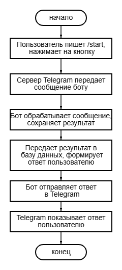
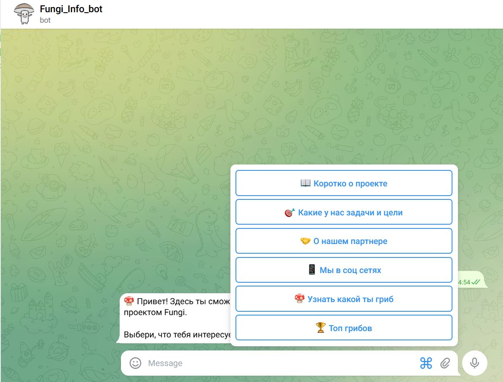
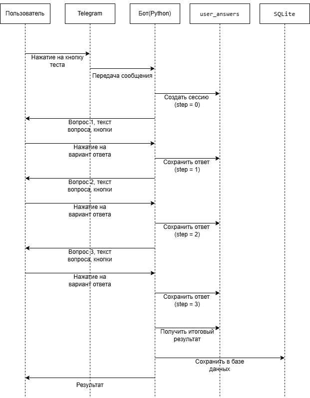

## Последовательность действий по исследованию предметной области и созданию технологии

### Этап 1. Изучение предметной области

**1.1. Поиск информации о Telegram-ботах**

Я начала с того, что изучила, что такое Telegram-боты, как они работают и для чего нужны. Для этого я читала статьи на Habr, смотрела видео на YouTube и изучала официальную документацию Telegram Bot API.

**Результат:** я поняла, что бот — это программа, которая общается с пользователями через Telegram, а Telegram предоставляет специальный интерфейс (API) для таких программ.

**1.2. Анализ существующих проектов**

Я посмотрела несколько готовых Telegram-ботов образовательной тематики. Обращала внимание на то, какие у них кнопки, как они отвечают, есть ли игры или тесты.

**Результат:** я решила, что, помимо информации о проекте, добавлю в своего бота мини-квиз — это повысит интерес пользователей к боту.

**1.3. Определение требований к моему боту**

На основе изученного я сформулировала, что должен уметь мой бот:

- Приветствовать пользователя при старте
- Показывать информацию о проекте Fungi
- Проводить шуточный тест «Какой ты гриб»
- Сохранять результаты теста
- Показывать статистику (топ популярных грибов)

**Результат:** получилось техническое задание для самой себя.

---

### Этап 2. Выбор технологий

**2.1. Выбор языка программирования**

Я рассмотрела Python, JavaScript и Go. Язык программирования Python я знала, поэтому выбрала его. Кроме того, для Python есть много готовых библиотек для Telegram-ботов, что упрощает задачу создания.

**Результат:** для создания бота был использован язык Python версии 3.10.

**2.2. Выбор библиотеки для работы с Telegram**

Я сравнила две популярные библиотеки: aiogram и python-telegram-bot. Выбрала aiogram, потому что она современная, асинхронная и хорошо документирована.

**Результат:** выбрана библиотека aiogram 3.x.

**2.3. Выбор базы данных**

Нужно было где-то хранить результаты квиза. Я рассматривала SQLite и PostgreSQL. SQLite не требует установки отдельного сервера и уже встроен в Python, поэтому я выбрала его.

**Результат:** выбрана SQLite.

**2.4. Выбор способа хранения токена**

Токен бота нельзя хранить прямо в коде, потому что при публикации на GitHub его увидят другие люди. Я использовала библиотеку python-dotenv и файл .env.

**Результат:** токен хранится в отдельном файле, который не попадает в репозиторий.

---

### Этап 3. Создание бота (пошагово)

**3.1. Регистрация бота у BotFather**

Я написала @BotFather в Telegram, создала нового бота и получила токен.

**Результат:** получен токен вида `1234567890:ABCdefGHIjklMNOpqrsTUVwxyz`.

**3.2. Настройка окружения на компьютере**

Я создала папку для проекта, установила виртуальное окружение и установила нужные библиотеки через pip.

**Результат:** рабочее окружение, в котором можно писать код.

**3.3. Написание кода (по частям)**

Я писала код постепенно, проверяя работу после каждого добавления:

- Сначала сделала команду `/start` и простой ответ.
- Потом добавила кнопки и обработку нажатий.
- Потом сделала квиз с inline-кнопками.
- Потом подключила базу данных для сохранения результатов.
- Потом добавила кнопку «Топ грибов» как модификацию.

**Результат:** полностью рабочий бот.

**3.4. Тестирование**

Я запускала бота на своём компьютере и проверяла каждую кнопку. Нажимала на все варианты ответов в квизе, смотрела, сохраняются ли данные в базу.

**Результат:** все ошибки исправлены, бот работает стабильно.

# Техническое руководство по созданию Telegram-бота

## Это руководство для начинающих программистов. Достаточно знать самые основы Python: переменные, функции, условные операторы (if-else).

**Вот список того, что будет уметь бот после прохождения руководства:**

1. Приветствовать пользователя после команды `/start`
2. Показывать меню из нескольких кнопок
3. Отвечать на нажатие кнопок информацией
4. Проводить квиз (тест) из нескольких вопросов
5. Сохранять результаты каждого прохождения в базу данных
6. Показывать статистику (например, топ самых популярных ответов)

Наполнение бота — тексты кнопок, содержание информационных блоков, тема и вопросы квиза — может быть любым

**Как это работает (простыми словами):**

1. Пользователь пишет боту сообщение или нажимает кнопку
2. Telegram получает это сообщение и отправляет его вашему боту
3. Ваш бот (программа на Python) обрабатывает сообщение
4. Бот отправляет ответ обратно в Telegram
5. Telegram показывает ответ пользователю

---

## Шаг 1. Установка Python

Python — это язык программирования, на котором мы будем писать бота.

**Проверьте, установлен ли Python:**

Откройте командную строку (терминал):

- На Windows: нажмите Win+R, введите `cmd`, нажмите Enter
- На Mac: найдите приложение «Терминал»
  Введите команду: **python --version**
  **Если вы видите что-то вроде `Python 3.10.0` или выше** — отлично, переходите к Шагу 2.

**Если вы видите ошибку «python не найден»** — значит Python не установлен. Сделайте следующее:

1. Зайдите на сайт: https://www.python.org/downloads/
2. Нажмите жёлтую кнопку «Download Python»
3. Запустите скачанный файл
4. **ВАЖНО!** В самом начале установки поставьте галочку «Add Python to PATH»
5. Нажмите «Install Now»
6. После установки перезагрузите компьютер

---

## Шаг 2. Создание папки для проекта

Создайте отдельную папку, где будет лежать ваш проект.
Откройте командную строку и напишите:

```
mkdir имя_папки
cd имя_папки
```
mkdir имя_папки — создать папку с выбранным именем
cd имя_папки — перейти в эту папку

## Шаг 3. Создание виртуального окружения

Виртуальное окружение — это изолированная среда, где будут находиться только библиотеки для вашего проекта.
Создаём виртуальное окружение:
```
python -m venv venv
```
Активируем его:

Ваша операционная система	| Команда
Windows	| venv\Scripts\activate
Mac или Linux	| source venv/bin/activate

Если все успешно, то в начале строки появится (venv).

## Шаг 4. Установка библиотек

Библиотеки — это готовые куски кода, написанные другими программистами. Мы будем использовать:
aiogram — для работы с Telegram Bot API
python-dotenv — для безопасного хранения токена
В командной строке (с активированным виртуальным окружением) введите:
```
pip install aiogram python-dotenv
```
Дождитесь окончания установки.

## Шаг 5. Создание бота в Telegram и получение токена

Токен — это специальный ключ, который Telegram выдаёт вашему боту.
Пошаговая инструкция:
1. Откройте Telegram на телефоне или компьютере
2. В поиске найдите пользователя @BotFather
3. Начните с ним диалог (нажмите «Start» или «Начать»)
4. Отправьте команду: /newbot
5. Придумайте имя бота (например, MyInfoBot). Это имя будут видеть пользователи.
6. Придумайте username. Он должен заканчиваться на _bot (например, my_info_bot). По этому username пользователи будут находить вашего бота.
7. BotFather отправит вам сообщение с токеном. Токен выглядит примерно так: 1234567890:AAHdqTcvCH1vGWJxfSeofSAs0K5PALDsaw9

## Шаг 6. Сохранение токена в файл
Создайте в папке проекта файл .env. В этом файле будет храниться токен.
Как создать файл .env:
Способ для Windows (Блокнот):
1. Откройте Блокнот
2. Напишите: BOT_TOKEN=ваш_токен (вместо ваш_токен вставьте настоящий токен)
3. Нажмите «Файл» → «Сохранить как»
4. В поле «Имя файла» напишите: .env
5. В поле «Тип файла» выберите: «Все файлы (.)»
6. Сохраните файл в папку проекта
Способ через командную строку:
```
echo BOT_TOKEN=ваш_токен > .env
```
Правильный формат файла .env:

BOT_TOKEN=1234567890:AAHdqTcvCH1vGWJxfSeofSAs0K5PALDsaw9
Обратите внимание:
- Нет пробелов вокруг знака =
- Нет кавычек
- Нет лишних слов
## Шаг 7. Написание кода бота
Создайте в папке проекта новый файл с именем bot.py.

Часть 1. Импорт библиотек и настройка
---
```
import asyncio
import os
import sqlite3
from datetime import datetime
from dotenv import load_dotenv
from aiogram import Bot, Dispatcher, types
from aiogram.filters import Command
from aiogram.types import ReplyKeyboardMarkup, KeyboardButton, InlineKeyboardMarkup, InlineKeyboardButton

# Загружаем токен из файла .env
load_dotenv()
BOT_TOKEN = os.getenv("BOT_TOKEN")

# Проверяем, загрузился ли токен
if not BOT_TOKEN:
    raise ValueError("Токен не найден! Проверь файл .env")

# Создаём бота и диспетчер
bot = Bot(token=BOT_TOKEN)
dp = Dispatcher()
```
Часть 2. Настройка текстов
---
В этом классе вы определяете, какие кнопки будут у бота и что он будет отвечать.
```
class MenuText:
    BTN_1 = "📖 О проекте"           # Первая кнопка
    BTN_2 = "🎯 Наши цели"           # Вторая кнопка
    BTN_3 = "🤝 Партнёры"            # Третья кнопка
    BTN_4 = "📱 Соцсети"             # Четвёртая кнопка
    BTN_QUIZ = "❓ Пройти тест"      # Кнопка для запуска квиза
    BTN_STATS = "📊 Статистика"      # Кнопка для показа статистики
    
    MSG_START = "Привет! Я бот проекта. Выберите, что вас интересует:"
    MSG_1 = "Информация о проекте..."           # Напишите свой текст
    MSG_2 = "Наши цели и задачи..."             # Напишите свой текст
    MSG_3 = "Информация о партнёрах..."         # Напишите свой текст
    MSG_4 = "Наши соцсети: ..."                 # Напишите свой текст
    
    @classmethod
    def get_all_buttons(cls):
        """Возвращает все кнопки в нужном порядке"""
        return [
            [KeyboardButton(text=cls.BTN_1)],
            [KeyboardButton(text=cls.BTN_2)],
            [KeyboardButton(text=cls.BTN_3)],
            [KeyboardButton(text=cls.BTN_4)],
            [KeyboardButton(text=cls.BTN_QUIZ)],
            [KeyboardButton(text=cls.BTN_STATS)]
        ]
```
Вот так будут выглядить кнопки в боте


Часть 3. База данных
---
```
def init_db():
    """Создаёт таблицу в базе данных, если её ещё нет"""
    conn = sqlite3.connect("quiz_stats.db")
    cursor = conn.cursor()
    cursor.execute('''
        CREATE TABLE IF NOT EXISTS quiz_results (
            id INTEGER PRIMARY KEY AUTOINCREMENT,
            user_id INTEGER,
            username TEXT,
            answer TEXT,
            date TEXT
        )
    ''')
    conn.commit()
    conn.close()

def save_result(user_id, username, answer):
    """Сохраняет результат квиза в базу данных"""
    conn = sqlite3.connect("quiz_stats.db")
    cursor = conn.cursor()
    cursor.execute(
        "INSERT INTO quiz_results (user_id, username, answer, date) VALUES (?, ?, ?, ?)",
        (user_id, username, answer, datetime.now().strftime("%Y-%m-%d %H:%M:%S"))
    )
    conn.commit()
    conn.close()

def get_stats(limit=5):
    """Возвращает статистику (топ самых популярных ответов)"""
    conn = sqlite3.connect("quiz_stats.db")
    cursor = conn.cursor()
    cursor.execute('''
        SELECT answer, COUNT(*) as count 
        FROM quiz_results 
        GROUP BY answer 
        ORDER BY count DESC 
        LIMIT ?
    ''', (limit,))
    results = cursor.fetchall()
    conn.close()
    return results
```
Часть 4. Вопросы для квиза
---
Здесь вы определяете, какие вопросы будут в квизе. Каждый вопрос содержит:  
question — текст вопроса  
options — список вариантов ответа  
results — соответствие между вариантом ответа и результатом  
```
QUIZ = [
    {
        "question": "Ваш первый вопрос?",
        "options": ["Вариант А", "Вариант Б", "Вариант В", "Вариант Г"],
        "results": {
            "Вариант А": "Результат 1",
            "Вариант Б": "Результат 2",
            "Вариант В": "Результат 3",
            "Вариант Г": "Результат 4"
        }
    },
    {
        "question": "Ваш второй вопрос?",
        "options": ["Вариант А", "Вариант Б", "Вариант В", "Вариант Г"],
        "results": {
            "Вариант А": "Результат 1",
            "Вариант Б": "Результат 2",
            "Вариант В": "Результат 3",
            "Вариант Г": "Результат 4"
        }
    },
    {
        "question": "Ваш третий вопрос?",
        "options": ["Вариант А", "Вариант Б", "Вариант В", "Вариант Г"],
        "results": {
            "Вариант А": "Результат 1",
            "Вариант Б": "Результат 2",
            "Вариант В": "Результат 3",
            "Вариант Г": "Результат 4"
        }
    }
]

# Словарь для хранения ответов пользователей во время квиза
user_answers = {}
```
Часть 5. Клавиатура
---
```
def get_main_keyboard():
    """Создаёт клавиатуру с кнопками главного меню"""
    return ReplyKeyboardMarkup(
        keyboard=MenuText.get_all_buttons(), 
        resize_keyboard=True
    )
```
Часть 6. Обработчик команды /start
---
```
@dp.message(Command("start"))
async def cmd_start(message: types.Message):
    """Когда пользователь пишет /start, показываем приветствие и кнопки"""
    await message.answer(MenuText.MSG_START, reply_markup=get_main_keyboard())
```
Часть 7. Обработка информационных кнопок
---
```
@dp.message(lambda message: message.text in [MenuText.BTN_1, MenuText.BTN_2, MenuText.BTN_3, MenuText.BTN_4])
async def handle_info(message: types.Message):
    """В зависимости от того, какую кнопку нажал пользователь, показываем нужный текст"""
    texts = {
        MenuText.BTN_1: MenuText.MSG_1,
        MenuText.BTN_2: MenuText.MSG_2,
        MenuText.BTN_3: MenuText.MSG_3,
        MenuText.BTN_4: MenuText.MSG_4,
    }
    await message.answer(texts[message.text], reply_markup=get_main_keyboard())
```
Часть 8. Кнопка статистики
---
```
@dp.message(lambda message: message.text == MenuText.BTN_STATS)
async def show_stats(message: types.Message):
    """Показывает статистику (топ самых популярных ответов)"""
    stats = get_stats(5)
    if not stats:
        await message.answer(f"Пока никто не проходил тест! Будь первым — нажми '{MenuText.BTN_QUIZ}'", reply_markup=get_main_keyboard())
        return
    
    text = "Топ самых популярных ответов:\n\n"
    for i, (answer, count) in enumerate(stats, 1):
        # Правильное склонение
        if count % 10 == 1 and count % 100 != 11:
            word = "раз"
        elif 2 <= count % 10 <= 4 and (count % 100 < 10 or count % 100 >= 20):
            word = "раза"
        else:
            word = "раз"
        text += f"{i}. {answer} — {count} {word}\n"
    
    await message.answer(text, reply_markup=get_main_keyboard())
```
Часть 9. Квиз
---
```
@dp.message(lambda message: message.text == MenuText.BTN_QUIZ)
async def start_quiz(message: types.Message):
    """Запускает квиз"""
    user_id = message.from_user.id
    user_answers[user_id] = {"step": 0, "answers": []}
    await send_quiz_question(message, user_id)

async def send_quiz_question(message: types.Message, user_id: int):
    """Отправляет текущий вопрос квиза"""
    step = user_answers[user_id]["step"]
    if step >= len(QUIZ):
        await finish_quiz(message, user_id)
        return
    
    q = QUIZ[step]
    keyboard = InlineKeyboardMarkup(inline_keyboard=[
        [InlineKeyboardButton(text=opt, callback_data=f"quiz_{step}_{opt}")] for opt in q["options"]
    ])
    await message.answer(f"❓ Вопрос {step+1}/{len(QUIZ)}: {q['question']}", reply_markup=keyboard)

@dp.callback_query(lambda c: c.data and c.data.startswith("quiz_"))
async def handle_quiz_answer(callback: types.CallbackQuery):
    """Обрабатывает нажатие на кнопки ответа в квизе"""
    user_id = callback.from_user.id
    if user_id not in user_answers:
        await callback.message.answer(f"Начни тест заново кнопкой '{MenuText.BTN_QUIZ}'", reply_markup=get_main_keyboard())
        await callback.answer()
        return
    
    parts = callback.data.split("_")
    step = int(parts[1])
    answer = "_".join(parts[2:]).replace("_", " ")
    
    q = QUIZ[step]
    result = q["results"].get(answer, "Неопределённый результат")
    
    user_answers[user_id]["answers"].append(result)
    user_answers[user_id]["step"] += 1
    
    await callback.message.delete()
    
    if user_answers[user_id]["step"] >= len(QUIZ):
        await finish_quiz(callback.message, user_id)
    else:
        await send_quiz_question(callback.message, user_id)
    
    await callback.answer()

async def finish_quiz(message: types.Message, user_id: int):
    """Завершает квиз, сохраняет результат и показывает итог"""
    answers = user_answers[user_id]["answers"]
    final_result = answers[-1] if answers else "Неопределённо"
    
    username = message.from_user.username or message.from_user.first_name
    save_result(user_id, username, final_result)
    
    result_text = f"🎉 Ваш результат: **{final_result}**!\n\nСпасибо за участие!"
    await message.answer(result_text, reply_markup=get_main_keyboard())
    
    del user_answers[user_id]
```
Диаграмма последовательности процесса прохождения квиза  
  

Часть 10. Запуск бота
---
```
async def main():
    init_db()
    print("Бот запущен!")
    print("База данных: quiz_stats.db")
    print("Нажми /start в Telegram\n")
    await dp.start_polling(bot)

if __name__ == "__main__":
    asyncio.run(main())
```
## Шаг 8. Запуск бота
В командной строке (с активированным виртуальным окружением) выполните:
```
python bot.py
```
Если всё сделано правильно, вы увидите:
```
Бот запущен!
База данных: quiz_stats.db
Нажми /start в Telegram
```
Бот работает! Не закрывайте командную строку — бот работает только пока она открыта.
## Шаг 9. Тестирование бота в Telegram
1. Откройте Telegram на телефоне или компьютере
2. Найдите своего бота по username
3. Нажмите кнопку «Start» или отправьте команду /start
4. Проверьте работу всех кнопок
5. Пройдите квиз
6. Посмотрите статистику

# Модификация
в базовой версии бота результаты квиза нигде не сохранялись. После прохождения пользователь просто получал свой результат. Я добавила функцию сбора статистики и кнопку, которая показывает топ-5 самых популярных грибов среди всех пользователей.  
Зачем это нужно:
- Пользователям интересно сравнивать себя с другими
- Появляется элемент соревнования
- Стимулирует проходить квиз снова
- Администратор проекта видит, какие ответы самые популярные
## Что изменилось
Добавлена база данных SQLite, в которой сохраняются результаты пользователей. По кнопке "Топ грибов" любой пользователь бота может посмотреть статистику топ-5 самых популярных результата.  
## Техническая реализация
Шаг 1. Создание базы данных
---
Добавлена функция init_db(), которая создаёт файл quiz_stats.db и таблицу quiz_results:
```
def init_db():
    conn = sqlite3.connect("quiz_stats.db")
    cursor = conn.cursor()
    cursor.execute('''
        CREATE TABLE IF NOT EXISTS quiz_results (
            id INTEGER PRIMARY KEY AUTOINCREMENT,
            user_id INTEGER,
            username TEXT,
            mushroom_type TEXT,
            date TEXT
        )
    ''')
    conn.commit()
    conn.close()
```
Шаг 2. Сохранение результатов
---
Добавлена функция save_quiz_result(), которая вызывается в конце квиза:
```
def save_quiz_result(user_id, username, mushroom_type):
    conn = sqlite3.connect("quiz_stats.db")
    cursor = conn.cursor()
    cursor.execute(
        "INSERT INTO quiz_results (user_id, username, mushroom_type, date) VALUES (?, ?, ?, ?)",
        (user_id, username, mushroom_type, datetime.now().strftime("%Y-%m-%d %H:%M:%S"))
    )
    conn.commit()
    conn.close()
```
Шаг 3. Получение статистики
---
Добавлена функция get_top_mushrooms(), которая делает запрос к базе данных:
```
def get_top_mushrooms(limit=5):
    conn = sqlite3.connect("quiz_stats.db")
    cursor = conn.cursor()
    cursor.execute('''
        SELECT mushroom_type, COUNT(*) as count 
        FROM quiz_results 
        GROUP BY mushroom_type 
        ORDER BY count DESC 
        LIMIT ?
    ''', (limit,))
    results = cursor.fetchall()
    conn.close()
    return results
```
Шаг 4. Добавление кнопки в меню
---
Кнопка была добавлена в меню и в список всех кнопок

Шаг 5. Обработчик кнопки
---
Добавлен обработчик, который реагирует на нажатие кнопки «Топ грибов»:
```
@dp.message(lambda message: message.text == MenuText.BTN_TOP)
async def show_top_mushrooms(message: types.Message):
    top = get_top_mushrooms(5)
    if not top:
        await message.answer("📊 Пока никто не проходил квиз! Будь первым — нажми 'Узнать какой ты гриб'", reply_markup=get_main_keyboard())
        return
    
    text = "🏆 Топ-5 самых популярных грибов среди пользователей:\n\n"
    for i, (mushroom, count) in enumerate(top, 1):
        text += f"{i}. {mushroom} — {count} раз(а) 🍄\n"
    
    await message.answer(text, reply_markup=get_main_keyboard())
```
